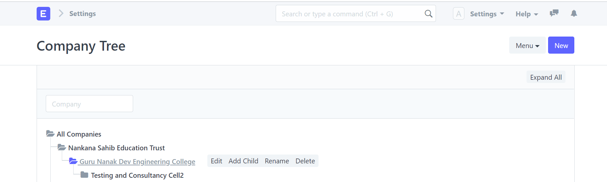
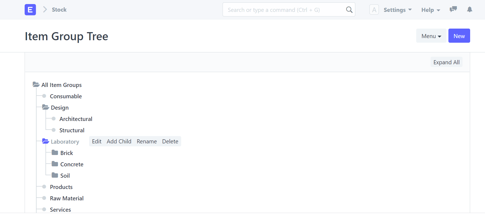

<!--
https://external-content.duckduckgo.com/iu/?u=https%3A%2F%2Ftse4.mm.bing.net%2Fth%3Fid%3DOIP.mYmv9Fjh8mJGHh5mvocmNQHaFj%26pid%3DApi&f=1


# **Marp**

Markdown Presentation Ecosystem

https://marp.app/ 
-->

---

<!--
# How to write slides

Split pages by horizontal ruler (`---`). It's very simple! :satisfied:
-->

---


# ```Company```

<<<<<<< HEAD

=======

>>>>>>> e197cd5477b84871c2d8c009d6b506adf4d208ae

---

# ```Item Group```


<!--
```markdown

```
-->

