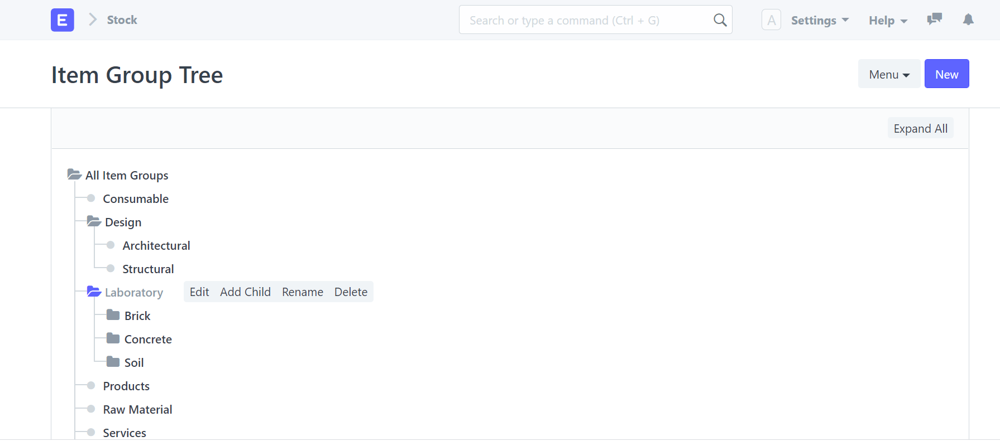
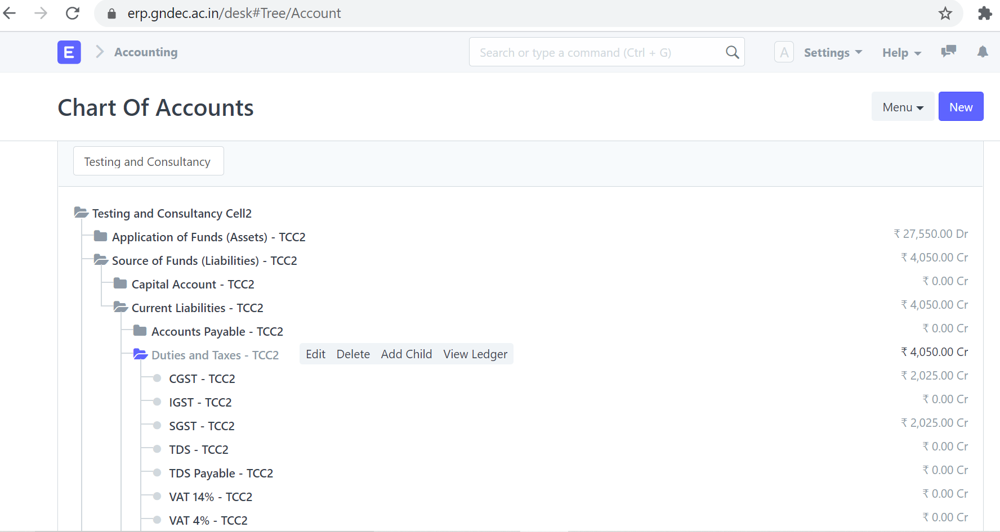
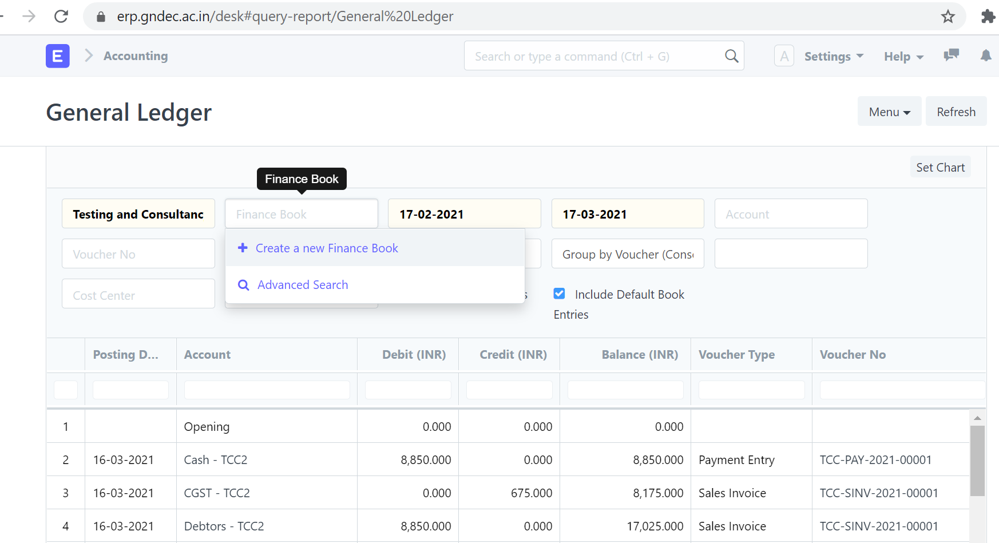
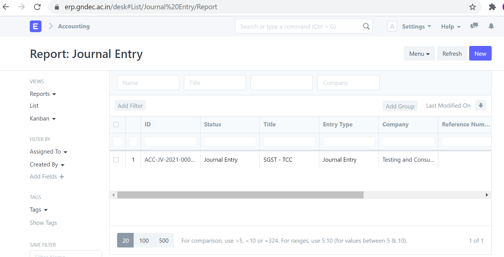
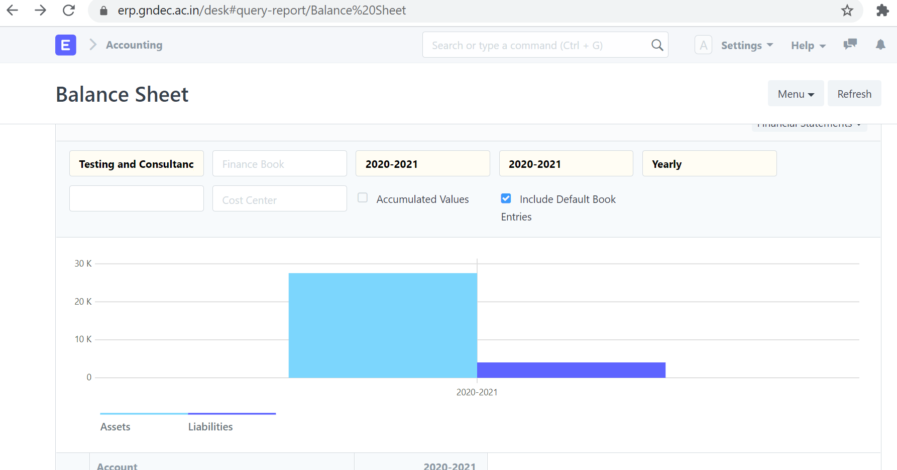
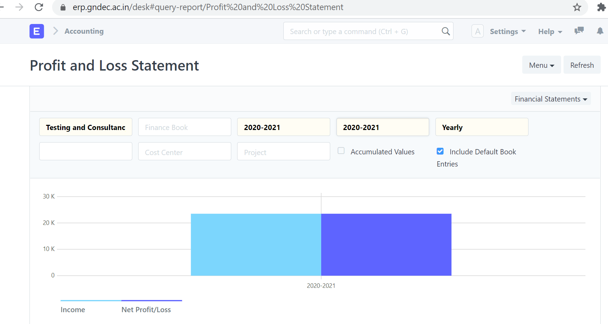

# ```ERPNext```

---

# ```Company```


---

# ```Item Group```


---
# ```Item List```


---
# ```Customer List```


----
# ```Quotation```


----
# ```Sales order```


---

# ```Delivery Note```


----
# ```Payment Request```


----
# ```Sales Invoice```


----
# ```Payment Entry```


----
# ```Chart of Accounts```


----
# ```General Ledger```



---
# ```Journal Entry```



---
# ```Balance Sheet```


------

# ```Profit and Loss Statement```


<!--

https://external-content.duckduckgo.com/iu/?u=https%3A%2F%2Ftse4.mm.bing.net%2Fth%3Fid%3DOIP.mYmv9Fjh8mJGHh5mvocmNQHaFj%26pid%3DApi&f=1

-->

